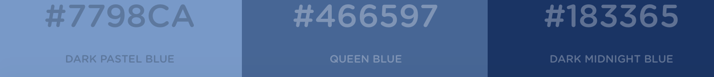

# City of Bloomington (BLOOMINGTON.IN.GOV)
Pattern Library

Drafted September 14, 2016
Updated February 4, 2017

This pattern library is a UI/UX style guide that provides pattern documentation for designers, developers, and web producers creating assets for the City of Bloomington (IN) web properties. 

## Design principles

Our design framework allows us to create a website that:

1. Renders across a range of browsers
The City of Bloomington website displays consistently and legibly on a wide range of devices using a mobile-first approach, a responsive design based on a flexible grid system, and industry-standard technologies.

2. Has a consistent UI, visual style, navigation, and interaction
To provide a unified experience, we ensure that persistent elements and components exist throughout the site to help users navigate it. Through our consistent implementation of color, design, branding, and navigational elements, users should be able to orient themselves wherever they may be within the site.

3. Contains searchable and findable content
In addition to a hierarchical navigational structure, we provide a persistent search function, the principal method users find data on the web. Whether they drill down, traverse, perform a site search, or arrive at the site from a search engine, users should be able to find what they need quickly, and we provide the means to do so with a logical content hierarchy, a robust search function, and search-engine-optimization techniques.

4. Is accessible
We implement a user-centric design for a wide variety of users, no matter their abilities or skill level. It's simple and intuitive, using clear typography and distinct page sections. You don't have to be a techie to use it.

## CSS
Documentation of typographic styles displayed across sites.

### Font
The site uses Work Sans as its main font. Base size is 20px.

*We use Sass variables for font weights.*

## Components
## Javascript
## Templates

#### Color Palette

The primary color palette for city web properties is blue, keeping consistent with city branding in print and on vehicles. This document seeks simply to establish a consistent visual brand for digital properties. 

###### Primary colors

###### Background colors

These colors are used primarily for background wells and fields. When alternating between tones, be sure to use enough tones providing enough contrast between adjacent wells.

###### Secondary colors

These colors are used primarily as accent colors, and should be used to add variety to page content and illustrations. They should never overpower the core brand colors.

#### Typography (Fonts)

Typography helps maintain a consistent brand identity internally and on public-facing materials. **[Nimbus Sans](https://typekit.com/fonts/nimbus-sans)** is the primary typeface for all city digital collateral. Recommended use: 48 px for headers, 18 px for content. **[FF Tisa](https://typekit.com/fonts/ff-tisa)** is the secondary typeface, best used for body copy and other small text. In instances where neither font is available, **Helvetica Neue** can be substituted. For web fonts, use **Roboto** as a primary typeface unless otherwise specified.

## Global elements

Our Global elements section contains structural elements that can be used to create the foundation of a webpage as well as elements that appear on every page. These elements are part of City of Bloomington’s [Factory Number One](https://github.com/City-of-Bloomington/factory-number-one), a pattern library built by in-house designers and developers to help us create visually consistent web products as easily as possible.

Page templates reflect common page types that we use within our Content Management System. They are documented here primarily for easy reference by our designers and secondarily as inspiration for anyone creating a system of components.

## Page components

## Microsite Definition and Policy

Microsites are modular, one-page sites that exist within the structure of the website. Unlike regular web templates, they might have flexibility relative to their design and navigation due to a need to have pages that require more creative freedom or serve primarily as marketing pages. 

## Reuse of open-source style guides

Much of the guidance contained in the City of Bloomington design manual is adapted from design, code and patterns from other civic & corporate guides including:

* Consumer Financial Protection Bureau’s [Design Manual](https://cfpb.github.io/design-manual/)

* UK Government Digital Service [content and publishing guidelines](https://www.gov.uk/topic/government-digital-guidance/content-publishing)

* US Digital Service [Web Design Standards](https://github.com/quarterback/web-design-standards)

* Mailchimp [Style Guide](http://styleguide.mailchimp.com)

